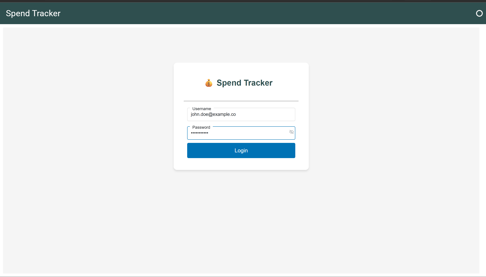
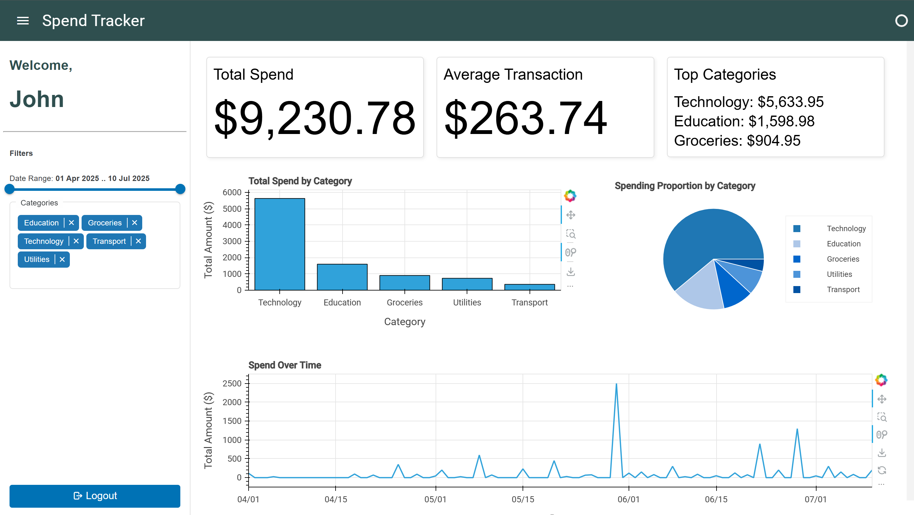

# 🎯 Customer Spending Analytics Dashboard

A full-stack analytics platform designed to provide insights into personal spending data. Built with modern technologies to demonstrate a complete software engineering workflow.




## 📋 Table of Contents

- [Overview](#overview)
- [Features](#features)
- [Technology Stack](#technology-stack)
- [Architecture](#architecture)
- [Quick Start](#quick-start)
- [API Documentation](#api-documentation)
- [Project Structure](#project-structure)
- [Development](#development)
- [Contributing](#contributing)

## 🎯 Overview

This analytics dashboard provides a comprehensive view of personal spending patterns through interactive visualizations and real-time filtering. The application features secure authentication, dynamic data visualization, and a modern responsive interface.

### Key Highlights

- **🔐 Secure Authentication** - JWT-based login system
- **📊 Interactive Analytics** - Real-time charts and metrics
- **🎨 Modern UI** - Material Design with responsive layout
- **🐳 Containerized** - Full Docker deployment
- **📈 Rich Data** - Mock data for three distinct user profiles

## ✨ Features

### Authentication & User Management
- Secure JWT-based authentication
- Multiple user profiles with different spending patterns
- Session management with automatic token handling

### Analytics Dashboard
- **Metric Cards**: Total spend, average transaction, top categories
- **Interactive Charts**: 
  - Bar chart (spending by category)
  - Line chart (spending over time)
  - Donut chart (category proportions)
- **Dynamic Filtering**: Date range and category selection
- **Real-time Updates**: All visualizations update reactively

### Data Management
- Rich mock data for three user profiles
- Comprehensive transaction history
- Category-based spending analysis
- Time-series data visualization

## 🛠️ Technology Stack

### Frontend
- **Panel** - Python-based web framework for interactive dashboards
- **HoloViews** - High-level plotting library
- **Bokeh** - Interactive visualization library
- **Pandas** - Data manipulation and analysis

### Backend
- **FastAPI** - Modern, fast web framework for building APIs
- **SQLAlchemy** - SQL toolkit and ORM
- **JWT** - JSON Web Token authentication
- **Pydantic** - Data validation using Python type annotations

### Database
- **PostgreSQL** - Robust, open-source relational database
- **SQLAlchemy ORM** - Database abstraction layer

### Infrastructure
- **Docker** - Containerization platform
- **Docker Compose** - Multi-container orchestration
- **Health Checks** - Service monitoring and dependency management

## 🏗️ Architecture

```
┌─────────────────┐    ┌─────────────────┐    ┌─────────────────┐
│   Frontend      │    │    Backend      │    │   Database      │
│   (Panel)       │◄──►│   (FastAPI)     │◄──►│  (PostgreSQL)   │
│   Port: 8501    │    │   Port: 8000    │    │   Port: 5432    │
└─────────────────┘    └─────────────────┘    └─────────────────┘
         │                       │                       │
         │                       │                       │
         ▼                       ▼                       ▼
   ┌─────────────────────────────────────────────────────────────┐
   │                    Docker Compose                          │
   │              Containerized Microservices                   │
   └─────────────────────────────────────────────────────────────┘
```

## 🚀 Quick Start

### Prerequisites

- **Docker Desktop** (Windows/Mac) or **Docker Engine** (Linux)
- **Docker Compose** (usually included with Docker)
- **4GB+ RAM** (for running all containers)
- **Modern web browser** (Chrome, Firefox, Safari, Edge)

### Step 1: Clone the Repository

```bash
git clone https://github.com/Sankeerth-S-Narayan/Customer-Spend-Tacker.git
cd Customer-Spend-Tacker
```

### Step 2: Create Environment File

Create a `.env` file in the root directory:

```bash
# PostgreSQL Database Configuration
POSTGRES_USER=analytics_user
POSTGRES_PASSWORD=analytics_password
POSTGRES_DB=analytics_db
POSTGRES_HOST=db
POSTGRES_PORT=5432

# Database URL for SQLAlchemy
DATABASE_URL=postgresql://analytics_user:analytics_password@db:5432/analytics_db

# JWT Authentication
SECRET_KEY=your-super-secret-jwt-key-change-this-in-production
ALGORITHM=HS256
ACCESS_TOKEN_EXPIRE_MINUTES=30
```

### Step 3: Start the Application

```bash
docker-compose up --build
```

### Step 4: Access the Application

- **🎨 Frontend Dashboard**: http://localhost:8501
- **🔧 Backend API**: http://localhost:8000
- **📚 API Documentation**: http://localhost:8000/docs

### Step 5: Login

Use any of these test accounts:

| Username | Password | User Type |
|----------|----------|-----------|
| `john.doe@example.com` | `password123` | Practical Spender |
| `jane.doe@example.com` | `password123` | Social Spender |
| `charlie@example.com` | `password123` | Lifestyle Spender |

## 📚 API Documentation

### Authentication Endpoints

- `POST /api/v1/login` - User authentication
- `GET /api/v1/users/me` - Get current user information

### Data Endpoints

- `GET /api/v1/transactions` - Get filtered transaction data
- `GET /api/v1/transactions/metrics` - Get aggregated analytics

### Query Parameters

- `start_date` - Filter transactions from this date (YYYY-MM-DD)
- `end_date` - Filter transactions until this date (YYYY-MM-DD)
- `categories` - Comma-separated list of categories to filter
- `skip` - Number of records to skip (pagination)
- `limit` - Maximum number of records to return

## 📁 Project Structure

```
Customer-Spend-Tacker/
├── frontend/                 # Panel web application
│   ├── app/
│   │   ├── main.py          # Main application controller
│   │   ├── services/
│   │   │   └── api_client.py # Backend API communication
│   │   └── views/
│   │       ├── login_view.py # Authentication interface
│   │       └── dashboard_components.py # Charts & metrics
│   ├── Dockerfile
│   └── requirements.txt
├── backend/                  # FastAPI REST API
│   ├── main.py              # Complete API implementation
│   ├── Dockerfile
│   └── requirements.txt
├── db/                      # Database initialization
│   └── init.sql             # Schema & mock data
├── docker-compose.yml       # Service orchestration
├── .env                     # Environment variables
├── README.md               # This file
├── login.png               # Login page screenshot
└── dashboard.png           # Dashboard screenshot
```

## 🛠️ Development

### Running in Development Mode

```bash
# Start services in detached mode
docker-compose up -d

# View logs
docker-compose logs -f

# Stop services
docker-compose down
```

### Troubleshooting

```bash
# Remove all containers and volumes (fresh start)
docker-compose down -v

# Rebuild and start
docker-compose up --build

# View logs for specific service
docker-compose logs backend
docker-compose logs frontend
docker-compose logs db
```

### Database Schema

#### Users Table
```sql
CREATE TABLE users (
    id SERIAL PRIMARY KEY,
    username VARCHAR(50) UNIQUE NOT NULL,
    password VARCHAR(255) NOT NULL,
    full_name VARCHAR(100),
    age_bracket VARCHAR(20),
    location VARCHAR(50),
    employment_status VARCHAR(30),
    created_at TIMESTAMP WITH TIME ZONE DEFAULT NOW()
);
```

#### Transactions Table
```sql
CREATE TABLE transactions (
    id SERIAL PRIMARY KEY,
    user_id INTEGER NOT NULL,
    amount NUMERIC(10, 2) NOT NULL,
    category VARCHAR(50) NOT NULL,
    description VARCHAR(255),
    transaction_date DATE NOT NULL,
    created_at TIMESTAMP WITH TIME ZONE DEFAULT NOW(),
    
    CONSTRAINT fk_user
        FOREIGN KEY(user_id) 
        REFERENCES users(id)
        ON DELETE CASCADE
);
```

## 🎨 User Profiles

The application includes three distinct user profiles with different spending patterns:

### John Doe (Practical Spender)
- **Focus**: Groceries, Utilities, Transport
- **Pattern**: Regular, essential expenses
- **Categories**: Groceries, Utilities, Transport, Technology, Education

### Jane Doe (Social Spender)
- **Focus**: Dining, Entertainment, Transport
- **Pattern**: Social activities and experiences
- **Categories**: Dining, Entertainment, Transport, Technology, Education

### Charlie Williams (Lifestyle Spender)
- **Focus**: Shopping, Travel, Health
- **Pattern**: Premium lifestyle and experiences
- **Categories**: Shopping, Travel, Health, Technology, Education


## 🙏 Acknowledgments

- Built as a learning project to demonstrate modern full-stack development practices
- Uses open-source technologies and follows best practices
- Designed for educational purposes and portfolio showcase

---


For questions or support, please open an issue on GitHub. 
