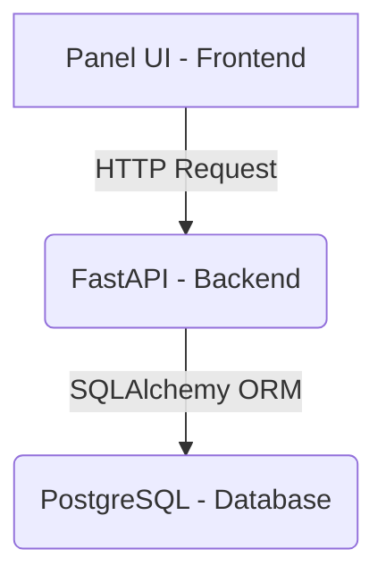

# 💰 Spend Tracker - System Design

**Version:** 1.0
**Date:** June 25, 2025

---

## 📌 Project Overview

### 🎯 Goal
To build a complete sample full-stack analytics platform that allows a user to:
- Log in
- View descriptive analytics dashboards on personal spending
- Interact with transaction data (filter, summarize, visualize)
- Experience a real-world engineering setup: frontend/backend/API integration, Dockerized services, GitHub Actions automation

This project is not deployed but runs entirely locally, giving hands-on practice with modern development workflows, CI/CD, and scalable architecture.

---

## 🧱 System Architecture

### ⚙️ Components:
- **Frontend:** Built with Panel (Python) for interactive dashboards and charting.
- **Backend:** FastAPI serving APIs for login, transaction data, and aggregated metrics.
- **Database:** PostgreSQL container storing users and transaction data.
- **APIs:**
  - **Internal:** REST API for login, data retrieval, and analytics.
  - **External:** Optionally pull simulated data from public APIs or use CSV.
- **Authentication:** Basic JWT authentication (simulated users).
- **Containerization:** Docker Compose for local orchestration.
- **CI/CD:** GitHub Actions pipeline to run tests, lint checks, and validate builds.
- **Version Control:** Git with feature branch strategy (dev, test, main).

---

## 🗺️ Architecture Diagram



---
## 🔧 Technology Stack

| Layer            | Technology       | Purpose / Justification                               |
|------------------|------------------|-------------------------------------------------------|
| Frontend         | Panel            | Pythonic dashboard building with Bokeh-style interactivity |
| Backend          | FastAPI           | Fast, async, and modern API server                    |
| Database         | PostgreSQL       | Structured storage with transaction & user relationships |
| Auth             | JWT (simulated)  | Lightweight token-based login                         |
| Containerization | Docker + Compose | Easy local orchestration of multiple services         |
| CI/CD            | GitHub Actions   | Automated linting, testing, and build checks          |
| Git Strategy     | Git + Branching  | Standard feature-branch + PR workflow                 |

---

## 🔄 User Journey

1.  **Login:**
    - User enters username/password.
    - Backend validates and issues a token.
2.  **Dashboard:**
    - User lands on the dashboard.
    - Panel requests analytics via API.
3.  **Filters & Interaction:**
    - Filters: date range, categories, amount.
    - Panel calls backend `/transactions` and `/metrics` endpoints.
4.  **Visualization:**
    - Metrics shown:
        - Total Spend
        - Average Monthly Spend
        - Top Categories (Pie Chart)
        - Spend Over Time (Line/Bar Chart)

---

## 🧾 API Design

| Endpoint        | Method | Description                                    | Requires Auth | Input / Params                       | Response      |
|-----------------|--------|------------------------------------------------|---------------|--------------------------------------|---------------|
| `/login`        | POST   | Authenticate user                              | ❌ No         | JSON (username/password)             | Token         |
| `/transactions` | GET    | Get filtered transactions                      | ✅ Yes        | Query params (date, category, amount) | JSON List     |
| `/metrics`      | GET    | Aggregated analytics (total, avg, top categories) | ✅ Yes        | None                                 | JSON Object   |

---

## 🗄️ Database Schema

### `Users` Table
| Column   | Type   | Notes                      |
|----------|--------|----------------------------|
| id       | SERIAL | Primary Key                |
| username | TEXT   | Unique                     |
| password | TEXT   | Plaintext or hashed (sim)  |

### `Transactions` Table
| Column    | Type      | Notes                        |
|-----------|-----------|------------------------------|
| id        | SERIAL    | Primary Key                  |
| user_id   | INT       | Foreign key to `Users`       |
| amount    | FLOAT     | Transaction value            |
| category  | TEXT      | e.g., Food, Travel           |
| timestamp | TIMESTAMP | When the transaction took place |

---

## 🐳 Docker Setup

### Project Structure
```bash
project-root/
├── frontend/               # Panel app
├── backend/                # FastAPI app
├── db/                     # SQL init scripts
├── docker-compose.yml
├── .env
```

### Docker Compose (`docker-compose.yml`)
```yaml
version: '3.9'

services:
  backend:
    build: ./backend
    ports:
      - "8000:8000"
    volumes:
      - ./backend:/app
    env_file:
      - .env
    depends_on:
      - db

  frontend:
    build: ./frontend
    ports:
      - "8501:8501"
    volumes:
      - ./frontend:/app
    depends_on:
      - backend

  db:
    image: postgres:15
    restart: always
    ports:
      - "5432:5432"
    volumes:
      - postgres_data:/var/lib/postgresql/data
      - ./db/init.sql:/docker-entrypoint-initdb.d/init.sql
    environment:
      POSTGRES_USER: user
      POSTGRES_PASSWORD: password
      POSTGRES_DB: analytics_db

volumes:
  postgres_data:
```

---

## 🔁 Git Strategy
- **main:** Stable, production-quality code
- **test:** Integration-tested and feature-merged
- **dev:** Active development
- **feature/*:** Feature branches
- **bugfix/*:** Bug fix branches

---

## 🔄 GitHub Actions (CI/CD)

### Pipeline Goals
On every push to `dev`, `test`, or `main`:
- ✅ Checkout code
- ✅ Install dependencies
- ✅ Run format check (`black`)
- ✅ Run linter (`flake8`)
- ✅ Run tests (`pytest`)

### Workflow File Example (`.github/workflows/main.yml`)
```yaml
name: CI Pipeline

on:
  push:
    branches:
      - dev
      - test
      - main

jobs:
  ci:
    runs-on: ubuntu-latest
    steps:
      - name: Checkout code
        uses: actions/checkout@v3

      - name: Setup Python
        uses: actions/setup-python@v4
        with:
          python-version: '3.10'

      - name: Install dependencies
        run: |
          pip install -r backend/requirements.txt
          pip install -r frontend/requirements.txt

      - name: Lint Check
        run: |
          flake8 backend
          flake8 frontend

      - name: Run Tests
        run: |
          pytest backend/tests
          pytest frontend/tests
```

---

## 🛠️ Development Flow (Recommended Order)

1.  Initialize Git repo, create `dev`, `main`, `test` branches.
2.  Define `.env` and Docker Compose setup.
3.  Create DB schema + seed data (use CSV or public API).
4.  Build FastAPI backend with JWT login, `/transactions`, `/metrics`.
5.  Build Panel frontend with basic layout.
6.  Connect frontend ↔ backend with API requests.
7.  Add filtering, charting.
8.  Write and test API unit tests.
9.  Setup GitHub Actions CI.
10. Final QA pass and prepare for future cloud deployment. 